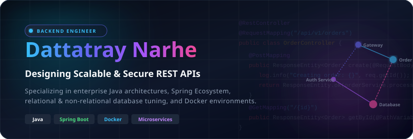

  

  
  &nbsp;&nbsp;
  

<blockquote>
  

    <i>"Clean code always looks like it was written by someone who cares." — Michael Feathers</i>
  

</blockquote>

---

### 👤 About Me & GitHub Stats

<table>
  <tr>
    <td valign="top" width="55%">
      <h4>👋 Hello, I'm Dattatray!</h4>
      
I am a software engineer specializing in building secure, high-throughput, and scalable RESTful APIs with <b>Java</b> and the <b>Spring Ecosystem</b>. I focus on database tuning, secure JWT authentication, and containerized microservice environments.

      <ul>
        <li>🔭 <b>Currently working on:</b> Java & Spring Boot backend services, microservice communications, and security filters.</li>
        <li>🌱 <b>Currently learning:</b> Advanced Microservices patterns, Kubernetes, and event-driven architecture (Kafka).</li>
        <li>👯 <b>Looking to collaborate on:</b> Enterprise backend integrations, cloud-native services, and database scaling.</li>
        <li>🤝 <b>Looking for help with:</b> Cloud infrastructure, DevOps automation, and distributed caching strategies.</li>
        <li>💬 <b>Ask me about:</b> Java, Spring Boot, Spring Security, RESTful endpoints, Docker, Postgres, and Redis.</li>
        <li>⚡ <b>Fun fact:</b> I love analyzing slow SQL queries and optimization bottlenecks to squeeze out performance 🚀</li>
      </ul>
    </td>
    <td valign="top" width="45%">
      
    </td>
  </tr>
</table>

---

### 🚀 Core Competencies & Architecture Focus

<table>
  <tr>
    <td width="50%" valign="top">
      <h5>🛡️ Secure API Design</h5>
      
Implementing stateless JWT token generation, filter chain custom policies, OAuth2 integration, and HTTPS encryption layers in Spring Boot REST APIs.

    </td>
    <td width="50%" valign="top">
      <h5>🐳 Containerization & Cloud Native</h5>
      
Packaging application environments with Docker multi-stage builds, managing multi-container deployments using Compose, and configuring custom health checks.

    </td>
  </tr>
  <tr>
    <td width="50%" valign="top">
      <h5>🗄️ Database Optimization</h5>
      
Structuring relational mappings with Hibernate, managing transactions, optimizing complex SQL queries, index creation, and distributed caching with Redis.

    </td>
    <td width="50%" valign="top">
      <h5>🔄 Microservices & Patterns</h5>
      
Designing decentralized data structures, API Gateways, Service Discovery, configuration centralization, and asynchronous event streams.

    </td>
  </tr>
</table>

---

### 🛠️ Tech Stack & Tools

<table>
  <tr>
    <td width="50%" valign="top">
      <h4>💻 Languages & Frameworks</h4>
      

        
        
        
        
        
      

      

        
        
        
      

    </td>
    <td width="50%" valign="top">
      <h4>🗄️ Databases, DevOps & Tools</h4>
      

        
        
        
        
        
      

      

        
        
        
        
        
      

      

        
        
        
        
      

    </td>
  </tr>
</table>

---

### 📊 GitHub Analytics

  
  &nbsp;&nbsp;&nbsp;&nbsp;
  

---
